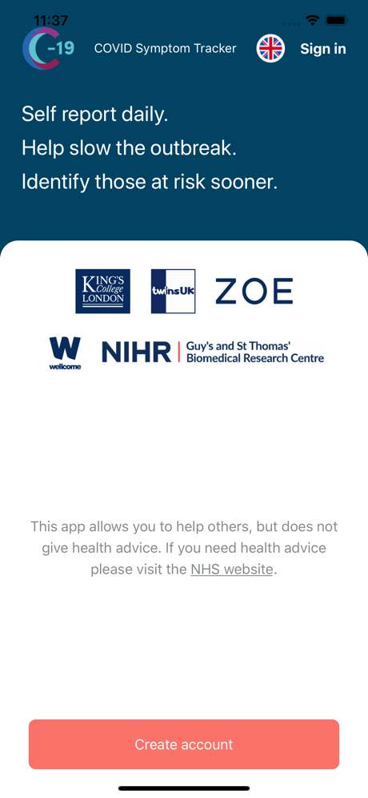

# COVID-19 Symptom Study

[](https://coveralls.io/github/zoe/covid-tracker-react-native?branch=selvach/coverage)

## Table of Contents

- [About The Project](#about-the-project)
  - [Built With](#built-with)
- [Getting Started](#getting-started)
  - [Prerequisites](#prerequisites)
  - [Installation](#installation)
  - [Tests](#tests)
- [Roadmap](#roadmap)
- [Contributing](#contributing)
- [Common Issues](#common-issues)
- [License](#license)
- [Contact](#contact)
- [Acknowledgements](#acknowledgements)

## About The Project

<p float="left" align="middle">
  
  
  
</p>

COVID Symptom Study is an open source Android and iOS app whose goal is to stop the spread of COVID-19 disease and help identify people who are at risk sooner.

The COVID Symptom Study was designed by doctors and scientists at King's College London, Guys and St Thomas’ Hospitals working in partnership with ZOE Global Ltd – a health science company.

If you're doing research on COVID-19 and you want to contribute or believe this initiative can help your efforts, please let us know at research@joinzoe.com

### Built With

- [React Native](https://reactnative.dev)
- [Expo](https://expo.io)
- [StoryBook](https://storybook.js.org/)

## Getting Started

These instructions will get you a copy of the project up and running on your local machine for development and testing purposes.

### Prerequisites

- npm
- expo-cli

```sh
npm install npm@latest -g
npm install expo-cli --g
```

### Installation

1. Clone the repo

   ```sh
   git clone git@github.com:zoe/covid-tracker-react-native.git
   ```

2. When you first start your application you should see the IP address in the console (located above the QR code). For example:

   ```sh
   exp://123.456.7.890:19000
   ```

3. Create a .env file - please note that http:// is required otherwise API requests will fail.

   ```sh
   echo "API_URL=http://<ip_address_host_here>:3000" > .env
   ```

   e.g.

   ```sh
   echo "API_URL=http://123.456.7.890:3000" > .env
   ```

   NOTE: if you change the .env file be sure to clear the metro cache to ensure your changes take place.

   ```
   rm -rf $TMPDIR/metro-*
   ```

   or

   ```
   expo clear-metro-cache
   ```

4. Run the following command to create `AMPLITUDE_KEY` environment variable:

   ```sh
   echo "AMPLITUDE_KEY=test_key" >> .env
   ```

5. Create an empty `./google-services.json` file in the root of the application.

   ```sh
   echo "{}" > google-services.json
   ```

6. Run the following commands

   ```bash
   npm install
   expo start
   ```

7. Run the mock server

   ```bash
   npm run mock-server
   ```

   - note: Mock server is currently unavailable (using)

### Git Hooks

The git hook checks can be manually disabled calling git commit and git push with the --no-verify flag if needed.

### Tests

1. Run the standard suite of integration tests

   ```bash
   npm test
   ```

2. Run the Detox E2E tests (iOS only as of April 2021) 
   [Set up Detox] (https://github.com/wix/Detox/blob/master/docs/Introduction.GettingStarted.md) (Pay attention to the iOS dependencies!)
   
   Build a binary with Detox - this will be used by the test suite to conduct your tests:
   ```bash
   detox build
   ```

   Then run the tests:
   ```bash
   detox test
   ```


2. Check the i18n strings for a locale are complete

   ```bash
   npm test:i18n sv-SE
   ```

### Style guide

Please refer to the [contributing guidelines](CONTRIBUTING.md).

## Storybook

We are trying to embrace Component Driven Design. To develop

1. Set `ENABLE_STORYBOOK=true` in `App.tsx`

1. Start the storybook server with `npm run storybook`. This will open a webpage where you can flip through the stories in this project, after you've connected a iOS or Android device via `expo start`.

## Roadmap

See the [open issues](https://github.com/zoe/covid-tracker-react-native/issues) for a list of proposed features (and known issues).

## Git usage

For working with git we follow the Gitflow Workflow, to read all about it see the following explanation: [https://www.atlassian.com/git/tutorials/comparing-workflows/gitflow-workflow](https://www.atlassian.com/git/tutorials/comparing-workflows/gitflow-workflow)

To summarise it:

- The **main** and **develop** branches are protected. It is not possible to directly commit to them.
- Developing is done on **feature** branches which are branched from develop and merged into develop through pull requests. Naming of these branches: feature/(short description of the feature)
- Bugfixes are done on **bugfix** branches which are branched from main and merged into main through pull requests. Naming of these branches: bugfix/(short description of the bugfix)

### Pull Requests

It is expected of the initiator of the PR to merge it themself after a reviewer approved it.

Our PR merging strategy is to squash the branch into develop and then fast-forward develop into master for a release.

## Contributing

Contributions are what make the open source community such an amazing place to learn, inspire, and create. Any contributions you make are **greatly appreciated** - see the [contributing guidelines](CONTRIBUTING.md).

1. Fork the Project
2. Create your Feature Branch (`git checkout -b feature/amazing-feature`)
3. Commit your Changes (`git commit -m 'Add some AmazingFeature'`)
4. Push to the Branch (`git push origin feature/amazing-feature`)
5. Open a Pull Request

## Common Issues

These are some known, common issues and their solutions:

1. Changes to .env don't get picked up.

- Solution: Change some of the source code or restart the expo project running `expo start -c`

2. Unable to resolve module `deprecated-react-native-listview`

- Solution: Running `rm -rf $TMPDIR/metro-cache` has been reported to solve the problem.

3. Sometimes when working with React Native a total reset is required to get things up and running again. There can be lots of reasons for this and some googling may be required, however, the following is a common approach that works for many instances:

```bash
watchman watch-del-all && rm package-lock.json && rm -rf node_modules && rm -rf $TMPDIR/metro-* && rm -rf $TMPDIR/haste-map-* && npm install
```

or run

```bash
expo reset
```

## Multiple iOS simulators

[How to run multiple ios simulators with expo](https://stackoverflow.com/questions/53924934/can-i-run-my-expo-app-on-multiple-ios-simulators-at-once)

## License

Distributed under the Apache 2.0 License. See `LICENSE` for more information.

## Contact

ZOE Engineering - engineering@joinzoe.com

## Acknowledgements

- [Contributor Covenant](https://www.contributor-covenant.org)
